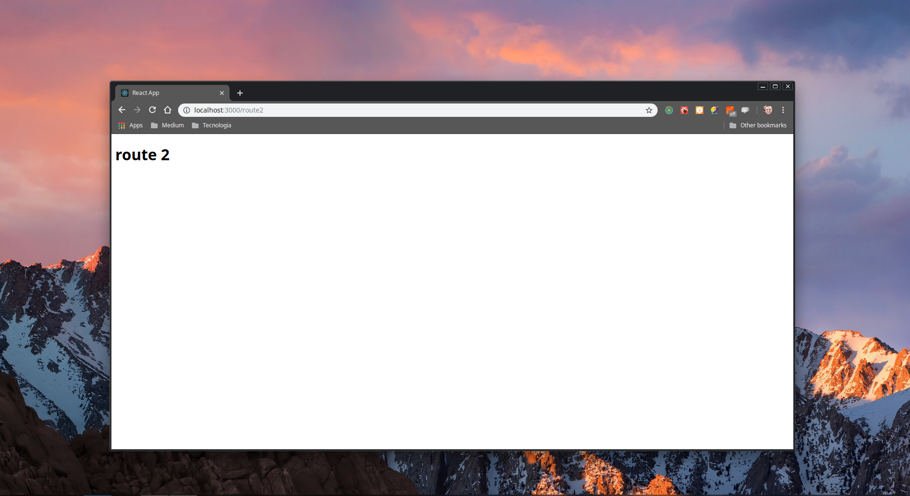

# base-react-boilerplate

Basic boilerplate with most react configurations, redux and router

### Prerequisites

```
Nodejs
```

### Installing

Open the terminal and execute the commands

- clone repository

```
git clone https://github.com/thiago-js/base-react-boilerplate.git
cd base-react-boilerplate
```

- install packages

```
npm install
```

## the project

I created this project in order to facilitate the construction of any project in react, with this boilerplate you do not have to worry about the basic configurations.

## Configurations

- [redux](https://github.com/reduxjs/redux)
- [redux-persist](https://github.com/rt2zz/redux-persist)
- [redux-thunk](https://github.com/reduxjs/redux-thunk)
- [redux-devtools-extension](https://github.com/zalmoxisus/redux-devtools-extension)

- [history](https://github.com/ReactTraining/history)
- [connect-react-router](https://github.com/supasate/connected-react-router)
- [combineReducers](https://redux.js.org/api/combinereducers)

## Start

```
npm start
```

### Routes

#### /

_implementation of a 'todo' in the standard redux'_


#### /route1

_implementation of a route change_


#### /route2

_implementation of a route change_



## Versioning

We use [SemVer](http://semver.org/) for versioning. For the versions available

## Author

- [**thiago-js**](https://github.com/thiago-js)
